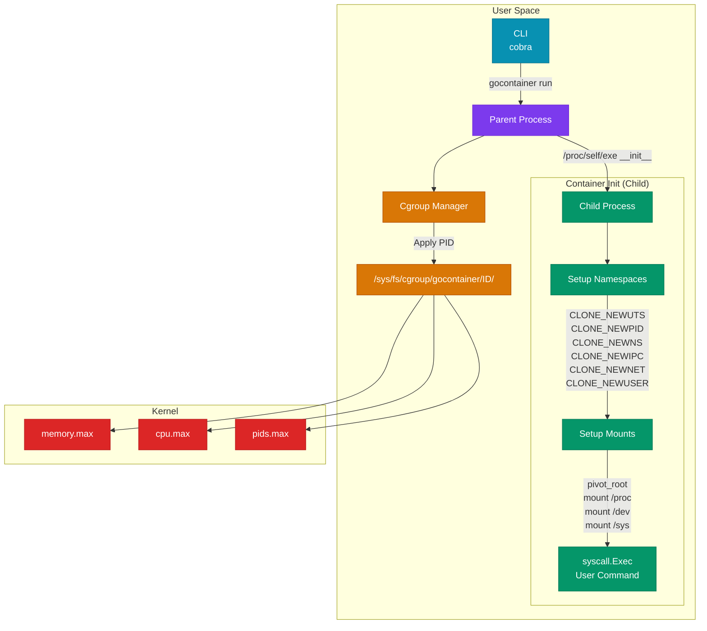
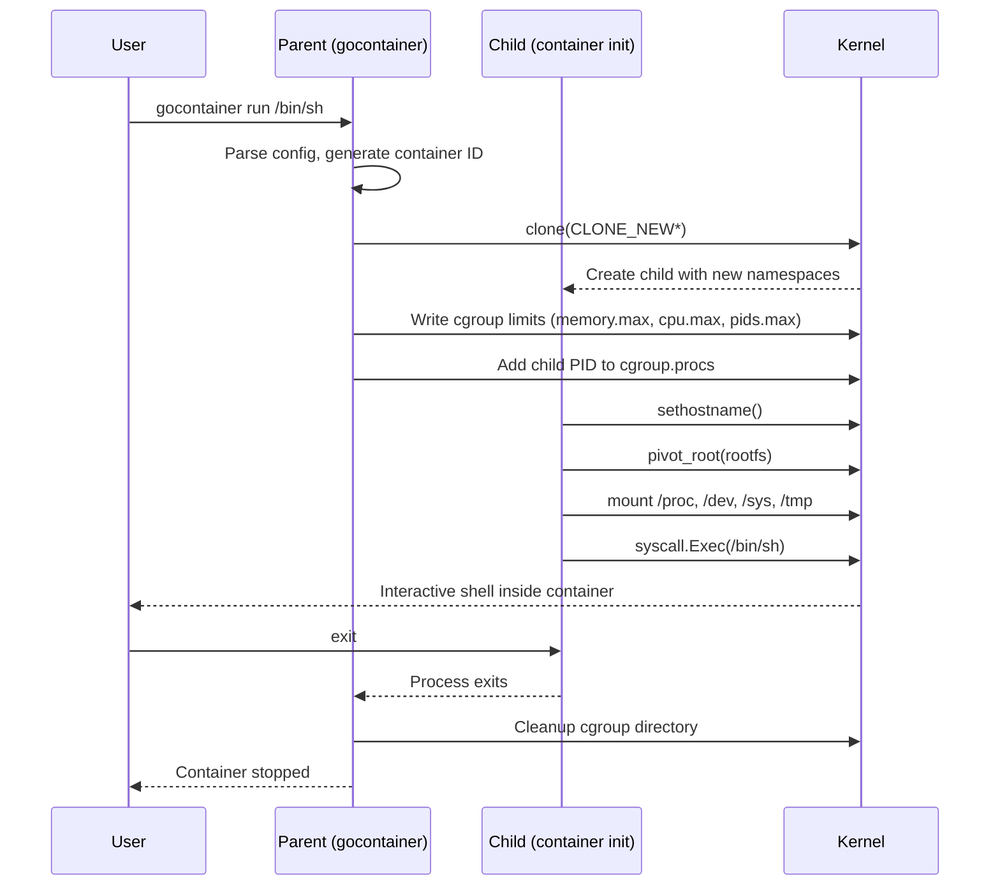

<p align="center">
  <h1 align="center">🐋 GoContainer</h1>
  <p align="center">
    <strong>A minimal container runtime built from scratch in Go</strong>
  </p>
  <p align="center">
    <a href="#quick-start">Quick Start</a> •
    <a href="#architecture">Architecture</a> •
    <a href="#how-it-works">How It Works</a> •
    <a href="#cli-reference">CLI Reference</a> •
    <a href="#benchmarks">Benchmarks</a> •
    <a href="#roadmap">Roadmap</a>
  </p>
  <p align="center">
    
    
    
    
  </p>
</p>

---

GoContainer is a **production-quality educational container runtime** that directly uses Linux kernel primitives — **namespaces** for isolation and **cgroups v2** for resource limits. No Docker dependency at runtime. No abstraction layers. Just raw `syscall` and `os` packages.

Built to demonstrate deep understanding of:
- **Operating Systems** — process isolation, filesystem pivoting, mount namespaces
- **Linux Kernel** — clone flags, cgroup v2 filesystem, /proc manipulation
- **Systems Programming** — re-exec pattern, UID/GID mappings, device nodes
- **Infrastructure** — how container runtimes actually work under the hood

## Architecture



### Container Lifecycle Sequence



## How It Works

### Linux Namespaces

Namespaces are the foundation of container isolation. Each namespace type isolates a different kernel resource:

| Namespace | Clone Flag | What It Isolates |
|-----------|-----------|-----------------|
| **UTS** | `CLONE_NEWUTS` | Hostname and domain name |
| **PID** | `CLONE_NEWPID` | Process IDs (container sees PID 1) |
| **Mount** | `CLONE_NEWNS` | Mount points (own filesystem view) |
| **IPC** | `CLONE_NEWIPC` | System V IPC, POSIX message queues |
| **Network** | `CLONE_NEWNET` | Network stack, interfaces, ports |
| **User** | `CLONE_NEWUSER` | UID/GID mappings (root in container ≠ root on host) |

### Re-exec Pattern

GoContainer uses the same **re-exec pattern** used by Docker and runc:

```
1. User:    gocontainer run /bin/sh
2. Parent:  fork(/proc/self/exe __init__ /rootfs myhost /bin/sh)
                              │
                              ├── New namespaces (clone flags)
                              ├── UID/GID mappings applied
                              └── Child starts in isolated environment
3. Child:   Detects "__init__" → SetHostname → PivotRoot → Exec(/bin/sh)
```

Why `/proc/self/exe`? Because the child needs to run setup code (mounts, hostname) **inside** the new namespaces. The parent can't do this — only the child exists in the new namespace. So we re-invoke the same binary with a special argument.

### Cgroup v2 Resource Limits

Cgroups v2 (unified hierarchy) controls resource consumption via the filesystem:

```
/sys/fs/cgroup/gocontainer/<container-id>/
├── cgroup.procs    ← Write PID here to add process to cgroup
├── memory.max      ← Hard memory limit in bytes (e.g., "268435456")
├── cpu.max         ← CPU quota/period (e.g., "50000 100000" = 50%)
└── pids.max        ← Max process count (e.g., "64")
```

### Pivot Root

`pivot_root` is more secure than `chroot`:
- **chroot**: Changes apparent root, but old root is still accessible
- **pivot_root**: Moves old root to a subdirectory, allows unmounting it completely

```go
// 1. Bind mount rootfs onto itself (required by pivot_root)
mount(rootfs, rootfs, MS_BIND|MS_REC)

// 2. Swap roots: rootfs becomes /, old root goes to /.pivot_root
pivot_root(rootfs, rootfs/.pivot_root)

// 3. Unmount and remove old root
unmount(/.pivot_root, MNT_DETACH)
rmdir(/.pivot_root)
```

## Quick Start

### Using Docker (Recommended — works on any OS)

```bash
# Build the Docker image
docker build -t gocontainer .

# Run a command inside a container
docker run --rm --privileged gocontainer run /bin/sh -c "echo hello && hostname && whoami"

# Interactive shell
docker run --rm -it --privileged gocontainer run /bin/sh

# With resource limits
docker run --rm --privileged gocontainer run --memory 128m --cpu 25 --pids 32 /bin/echo "limited!"
```

### From Source (Linux only)

```bash
# Clone and build
git clone https://github.com/user/gocontainer.git
cd gocontainer
make rootfs    # Download Alpine minirootfs
make build     # Compile binary

# Run (requires root for namespace/cgroup operations)
sudo ./bin/gocontainer run --rootfs ./rootfs /bin/sh

# Run tests
make test

# Run benchmarks
make bench
```

## CLI Reference

```
gocontainer — A minimal container runtime

COMMANDS:
  run         Run a command in an isolated container
  version     Print version information
  help        Show help

RUN FLAGS:
  -m, --memory    Memory limit (default: 256m)
                  Supports: 128m, 1g, 512k, 1073741824
  -c, --cpu       CPU quota percentage (default: 50)
                  Range: 1-100 (percentage of one CPU core)
  -p, --pids      Max processes (default: 64)
  --hostname      Container hostname (default: "container")
  --rootfs        Root filesystem path (default: /rootfs)
  -v, --verbose   Enable debug output

GLOBAL FLAGS:
  -h, --help      Show help for any command

EXAMPLES:
  gocontainer run /bin/sh
  gocontainer run --memory 128m --cpu 25 /bin/echo hello
  gocontainer run -m 512m -c 75 -p 128 /bin/sh -c "stress --cpu 2"
  gocontainer version
```

## Benchmarks

Run benchmarks with `make bench` or `make docker-bench`:

| Operation | Time/op | Allocs/op | Description |
|-----------|---------|-----------|-------------|
| `CgroupManager.Set` | ~15μs | 8 allocs | Write memory.max + cpu.max + pids.max |
| `CgroupManager.Apply` | ~8μs | 3 allocs | Write PID to cgroup.procs |
| `CgroupManager.GetResources` | ~12μs | 12 allocs | Read back all resource limits |
| `Full Lifecycle` | ~50μs | 30 allocs | Create → Set → Apply → Read → Cleanup |

> **Note**: These are cgroup filesystem operation benchmarks. Actual container startup includes fork, namespace setup, and mount operations which add ~10-50ms depending on the system.

## Testing

```bash
# Run unit tests (dockerized)
make docker-test

# Run unit tests locally (Go required)
make test

# Run with coverage report
make test-cover

# Run benchmarks
make bench

# Run integration tests (requires root + namespaces)
make integration
```

### Test Coverage

| Package | Coverage | Tests |
|---------|----------|-------|
| `internal/cgroup` | ~95% | 10 unit + 4 benchmarks |
| `internal/namespace` | ~90% | 7 unit tests |
| `internal/container` | ~85% | 12 unit tests |
| `internal/cli` | CLI integration | Via Docker |

## Project Structure

```
Runtime/
├── cmd/
│   └── gocontainer/
│       └── main.go              # Entry point (re-exec pattern handler)
├── internal/
│   ├── cli/
│   │   ├── root.go              # Cobra root command
│   │   ├── run.go               # `run` subcommand with flag parsing
│   │   └── version.go           # `version` with build-time info
│   ├── container/
│   │   ├── container.go         # Container lifecycle (New/Run/Wait/Stop)
│   │   ├── container_test.go    # Unit tests
│   │   └── config.go            # Config struct with validation
│   ├── namespace/
│   │   ├── namespace.go         # Clone flags, UID/GID mappings
│   │   ├── namespace_test.go    # Unit tests
│   │   └── mount.go             # pivot_root, /proc, /dev, /sys mounts
│   └── cgroup/
│       ├── cgroup.go            # Cgroup v2 manager (memory/CPU/PIDs)
│       ├── cgroup_test.go       # Unit tests (mock filesystem)
│       └── cgroup_bench_test.go # Benchmarks
├── scripts/
│   └── setup_rootfs.sh          # Alpine minirootfs download script
├── Dockerfile                   # Multi-stage: test → build → runtime
├── Makefile                     # Build automation (15+ targets)
├── go.mod / go.sum              # Go module dependencies
├── README.md                    # This file
├── CONTRIBUTING.md              # Contribution guidelines
└── LICENSE                      # MIT
```

## Roadmap

### v0.2.0 — Networking
- [ ] Bridge networking (veth pairs)
- [ ] Port forwarding (`--publish 8080:80`)
- [ ] DNS resolution inside container
- [ ] Network policy enforcement

### v0.3.0 — Image Management
- [ ] Pull OCI images from registries
- [ ] Layer caching with overlay filesystem
- [ ] Image build from Containerfile
- [ ] Local image storage and listing

### v0.4.0 — Runtime Compliance
- [ ] OCI Runtime Spec compliance
- [ ] Container checkpoint/restore (CRIU)
- [ ] Multi-container orchestration
- [ ] Health checks

### v0.5.0 — Security
- [ ] Seccomp filter profiles
- [ ] AppArmor/SELinux integration
- [ ] Capability dropping
- [ ] Read-only root filesystem

### v1.0.0 — Production Ready
- [ ] Logging driver (JSON, syslog)
- [ ] Resource usage monitoring
- [ ] Signal forwarding
- [ ] Graceful shutdown with configurable timeout

## Open Issues

| # | Title | Priority | Description |
|---|-------|----------|-------------|
| 1 | Network namespace has no connectivity | High | Currently creates isolated net namespace but no bridge/veth setup |
| 2 | User namespace requires root for some operations | Medium | `mknod` in `/dev` setup requires `CAP_MKNOD` even with user NS |
| 3 | No signal forwarding | Medium | SIGTERM/SIGINT not forwarded from parent to container process |
| 4 | Cgroup cleanup race condition | Low | If parent crashes, cgroup directory may be orphaned |
| 5 | No overlayfs support | Low | Currently requires full rootfs directory, no image layering |
| 6 | CPU quota supports only single core | Low | `cpu.max` quota is relative to one core, not multi-core aware |

## How GoContainer Compares

| Feature | GoContainer | Docker | runc |
|---------|------------|--------|------|
| Namespace isolation | ✅ 6 namespaces | ✅ | ✅ |
| Cgroup v2 limits | ✅ mem/cpu/pids | ✅ | ✅ |
| Pivot root | ✅ | ✅ | ✅ |
| OCI compliance | ❌ | ✅ | ✅ |
| Image pulling | ❌ | ✅ | ❌ |
| Networking | ❌ (planned) | ✅ | ❌ |
| Lines of code | ~800 | ~200K+ | ~15K |
| Dependencies | 2 (cobra, testify) | Many | Many |

> GoContainer is an **educational project** designed to demystify container runtimes. It implements the core primitives that production runtimes like runc and containerd are built on.

## Contributing

See [CONTRIBUTING.md](CONTRIBUTING.md) for development setup, code guidelines, and how to submit changes.

## License

[MIT](LICENSE) — Use it, learn from it, build on it.

---

<p align="center">
  <sub>Built with 💻 and raw syscalls. No magic, just Linux.</sub>
</p>
